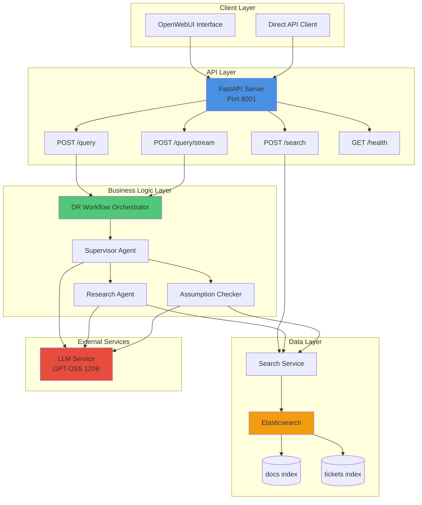
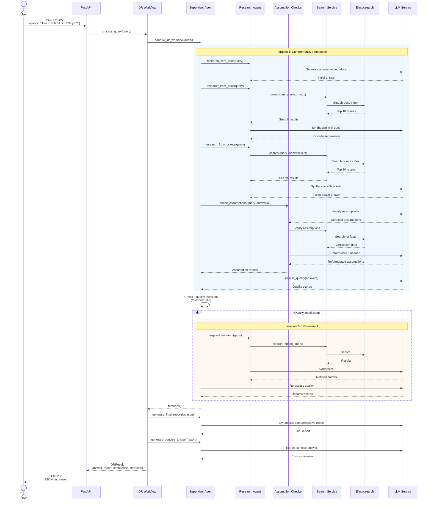

# HPC Ticket Knowledge Database - System Overview

## System Purpose
Multi-agent deep research system for HPC support questions, built on historical ticket data, HPC documentation, and knowledge base. Provides intelligent Q&A capabilities through supervised research agents and Elasticsearch-backed knowledge retrieval.

## Technology Stack
- **API Framework**: FastAPI (Python)
- **Search Engine**: Elasticsearch 8.11.0
- **LLM Integration**: LangChain + OpenAI-compatible API
- **Agent Framework**: LangGraph multi-agent workflow
- **Deployment**: Docker Compose
- **Integration**: OpenWebUI pipeline

## System Architecture



## Request Processing Flow



## Core Components

### 1. API Layer (`api/main.py`)
**Purpose**: Expose DR functionality via REST endpoints

**Key Endpoints**:
- `GET /health` - System health check
- `POST /query` - Synchronous query processing
- `POST /query/stream` - Server-sent events streaming
- `POST /search` - Direct Elasticsearch search bypass

**Configuration**: Environment-based via `DRConfig.from_env()`

### 2. DR Workflow (`DR_Pipeline/dr_workflow.py`)
**Purpose**: Orchestrate multi-agent research process

**Responsibilities**:
- Coordinate supervisor and agents
- Manage iteration loop (max 3 iterations)
- Calculate final confidence scores
- Generate comprehensive reports

### 3. Supervisor Agent (`DR_Pipeline/supervisor_agent.py`)
**Purpose**: Decision-making and quality control

**Functions**:
- Determine research strategies
- Assess answer quality (5-point scale)
- Decide when to stop iterating
- Synthesize final outputs

### 4. Research Agent (`DR_Pipeline/research_agent.py`)
**Purpose**: Execute different research strategies

**Research Types**:
- **Zero-shot**: LLM knowledge only
- **Docs-based**: HPC documentation search
- **Tickets-based**: Historical ticket search
- **Combined**: Multi-source synthesis

### 5. Assumption Checker (`DR_Pipeline/assumption_checker.py`)
**Purpose**: Validate and reformulate user assumptions

**Process**:
1. Extract implicit assumptions from query
2. Fact-check against documentation
3. Reformulate incorrect assumptions
4. Return positive statements only

### 6. Search Service (`DR_Pipeline/search_service.py`)
**Purpose**: Interface with Elasticsearch

**Features**:
- Multi-index search (docs, tickets)
- Query optimization for performance
- Retry logic with exponential backoff
- Result ranking and highlighting

## Data Flow Summary

1. **User Query** → FastAPI endpoint
2. **DR Workflow** initiates with supervisor
3. **Iteration Loop**:
   - Research agent queries Elasticsearch
   - LLM synthesizes results
   - Assumption checker validates facts
   - Supervisor assesses quality
   - Loop continues if quality < threshold
4. **Final Generation**:
   - Comprehensive report from all iterations
   - Concise answer (max 4 sentences)
   - Confidence scoring
5. **Response** returned to client

## Deployment Configuration

### Docker Compose Services
- **elasticsearch**: Single-node cluster, 2GB heap, volume persistence
- **dr-api**: FastAPI server, depends on Elasticsearch
- **indexer**: One-time data loading (profile: indexing)

### Environment Variables (Key)
```bash
# LLM
LLM_BASE_URL=http://lme49.cs.fau.de:30000/v1
LLM_MODEL=openai/gpt-oss-120b
LLM_TEMPERATURE=0.2

# Elasticsearch
ELASTIC_URL=http://elasticsearch:9200
DOCS_INDEX=docs
TICKETS_INDEX=tickets

# DR Settings
MAX_ITERATIONS=3
CONFIDENCE_THRESHOLD=0.6
MAX_SEARCH_RESULTS=10
```

## Performance Characteristics

- **Simple queries** (FAQ hit): 10-30 seconds
- **Complex queries** (multi-iteration): 60-120 seconds
- **Average confidence**: 0.75-0.85
- **Multi-iteration rate**: ~30% of queries

## Integration Points

### OpenWebUI Pipeline
- Exposes as model in OpenWebUI chat interface
- Streaming support via SSE
- Configurable timeouts and brief mode

### Elasticsearch Indices
- **docs**: HPC documentation (title, text, URL)
- **tickets**: Support tickets (problem, solution, root cause)

## Security Model (Current)

- **Authentication**: None (open endpoints)
- **CORS**: Wildcard allowed origins
- **Elasticsearch**: No authentication (single-node dev mode)
- **Secrets**: Environment variables

## Known Limitations

1. **Channel Tag Formatting**: GPT-OSS models occasionally include internal reasoning tags
2. **Sequential Processing**: No true parallel agent communication
3. **Search Strategy**: Simple keyword matching, no semantic embeddings
4. **Resource Limits**: No rate limiting or quota management
5. **Error Handling**: Broad exception catching without fine-grained recovery

## Monitoring & Observability

**Current State**:
- Print-based logging to stdout
- Basic health check endpoint
- No structured metrics
- No distributed tracing

**Recommended Additions**:
- Prometheus metrics
- Structured JSON logging
- Request correlation IDs
- Performance profiling

---

**Last Updated**: 2025-12-06
**Version**: 1.0.0
**Status**: Development (Not Production Ready)
