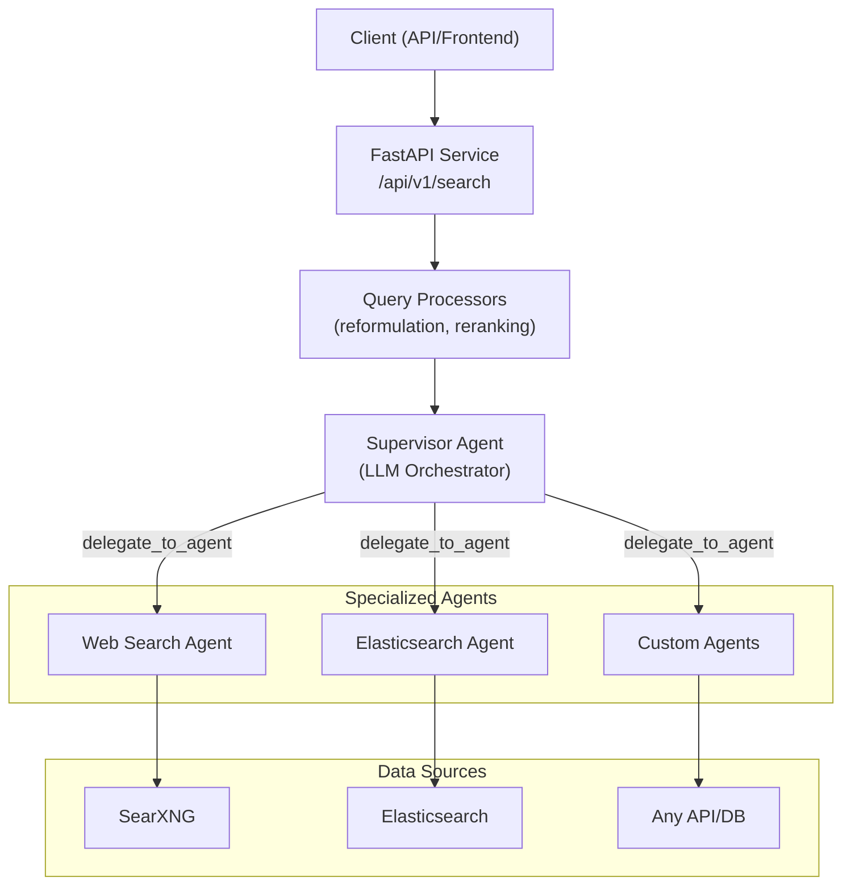

# Norizon DeepSearch

A modular multi-agent RAG (Retrieval-Augmented Generation) system where a supervisor LLM orchestrates specialized research agents via function calling. Built for extensibility and production deployment.

## Architecture Overview



## Key Features

- **Multi-Agent Architecture** - Supervisor delegates tasks to specialized agents via function calling
- **Query Processing Pipeline** - Reformulation, assumption checking, semantic reranking
- **Multiple LLM Providers** - OpenAI, Anthropic, GPT-OSS, Ollama (any OpenAI-compatible API)
- **Pluggable Search Backends** - Elasticsearch, SearXNG, extensible to any vector DB
- **Conversation History** - Multi-turn conversation support with context preservation
- **Observability** - Structured logging with correlation IDs, OpenTelemetry/Phoenix tracing
- **External Prompt Configuration** - All prompts in YAML files, no hardcoded text
- **Real-time Streaming** - SSE streaming for progress updates during search
- **Quality-Based Iteration** - Continues searching until quality threshold is met

## Quick Start

```bash
# 1. Setup environment
cd services/custom-deepresearch
python -m venv venv && source venv/bin/activate
pip install -r requirements.txt

# 2. Configure
cp .env.example .env
cp agents.example.yaml agents.yaml

# 3. Start dependencies (optional)
docker-compose up -d elasticsearch searxng

# 4. Run
uvicorn deepsearch.main:app --reload --port 8000

# 5. Verify
curl http://localhost:8000/api/v1/health
```

## Project Structure

```
custom-deepresearch/
├── deepsearch/
│   ├── agents/                 # Research agents
│   │   ├── base.py             # BaseAgent, AgentRegistry
│   │   ├── factory.py          # AgentFactory for dynamic creation
│   │   ├── config.py           # Agent configuration management
│   │   ├── reasoning.py        # ReasoningAgentMixin (tool loop)
│   │   ├── elasticsearch/      # Elasticsearch search agent
│   │   └── websearch/          # Web search agent (SearXNG)
│   ├── api/                    # FastAPI routes and models
│   │   ├── routes.py           # API endpoints
│   │   ├── models.py           # Request/response schemas
│   │   └── streaming.py        # SSE streaming
│   ├── llm/                    # LLM provider abstraction
│   ├── models/                 # Pydantic data models
│   │   ├── search.py           # Search request/response
│   │   ├── finding.py          # Research findings
│   │   └── workflow.py         # Workflow support
│   ├── observability/          # Logging and tracing
│   │   ├── logging.py          # Structured logging, correlation IDs
│   │   └── tracing.py          # OpenTelemetry/Phoenix integration
│   ├── processors/             # Query/result processors
│   │   ├── query_reformulator.py   # Query expansion
│   │   ├── assumption_checker.py   # Assumption validation
│   │   └── semantic_reranker.py    # Result reranking
│   ├── prompts/                # Prompt loading utilities
│   ├── retrievers/             # Search backend abstraction
│   │   ├── search_backends/    # Backend implementations
│   │   ├── search_methods/     # BM25, vector, hybrid
│   │   ├── preprocessors/      # Keyword extraction, stemming
│   │   └── search_pipeline.py  # Pipeline orchestration
│   ├── supervisor/             # Orchestration logic
│   │   ├── agent.py            # SupervisorAgent
│   │   └── quality.py          # QualityAssessor
│   ├── config.py               # Pydantic settings
│   └── main.py                 # FastAPI application
├── prompts/                    # YAML prompt templates
│   ├── supervisor.yaml
│   ├── elasticsearch_agent.yaml
│   ├── websearch_agent.yaml
│   ├── retriever.yaml
│   ├── query_reformulator.yaml
│   └── assumption_checker.yaml
├── tests/                      # Test suite
├── deploy/                     # Multi-customer deployment configs
├── agents.yaml                 # Agent configuration
└── docker-compose.yml          # Docker services
```

## Extension Points

### Adding a New Agent

Agents use a factory pattern with YAML configuration. See:
- `deepsearch/agents/factory.py` - AgentFactory implementation
- `deepsearch/agents/elasticsearch/agent.py` - Example agent implementation
- `agents.yaml` - Agent configuration format

### Adding a New Search Backend

Implement the `SearchBackend` interface. See:
- `deepsearch/retrievers/search_backends/` - Existing implementations
- `deepsearch/retrievers/search_pipeline.py` - Pipeline integration

### Customizing Prompts

All prompts are in `prompts/*.yaml`. Variables use `{placeholder}` syntax.
See `deepsearch/prompts/loader.py` for loading mechanism.

## API Endpoints

| Method | Endpoint | Description |
|--------|----------|-------------|
| `POST` | `/api/v1/search` | Start async search job |
| `POST` | `/api/v1/search/sync` | Synchronous search (blocking) |
| `GET` | `/api/v1/search/{job_id}` | Get job status |
| `GET` | `/api/v1/search/{job_id}/result` | Get completed result |
| `GET` | `/api/v1/search/{job_id}/stream` | SSE stream for progress |
| `GET` | `/api/v1/tools` | List registered agents |
| `GET` | `/api/v1/health` | Health check with component status |

See `deepsearch/api/routes.py` for full request/response schemas including `conversation_history` support.

## Configuration

### Environment Variables

| Variable | Default | Description |
|----------|---------|-------------|
| `DR_LLM_PROVIDER` | `gpt-oss` | Provider: `openai`, `anthropic`, `gpt-oss`, `ollama` |
| `DR_LLM_BASE_URL` | - | API endpoint URL |
| `DR_LLM_API_KEY` | - | API key |
| `DR_LLM_MODEL` | - | Model name |
| `DR_LLM_TEMPERATURE` | `0.7` | LLM temperature |
| `DR_MAX_ITERATIONS` | `3` | Max search iterations |
| `DR_QUALITY_THRESHOLD` | `0.7` | Stop when quality >= threshold |
| `DR_CONFIDENCE_THRESHOLD` | `0.5` | Minimum confidence for findings |
| `DR_REPORT_MAX_TOKENS` | `2000` | Max tokens for generated report |
| `DR_EXECUTION_STRATEGY` | `iterative` | `iterative` or `parallel` agent execution |
| `DR_LOG_LEVEL` | `INFO` | Logging level |

See `deepsearch/config.py` for full configuration options.

### Agent Configuration

Agents are configured in `agents.yaml`. See `agents.example.yaml` for format.

### Observability

Enable tracing by setting Phoenix/OpenTelemetry environment variables.
See `deepsearch/observability/tracing.py` for configuration options.

## Documentation

| Document | Description |
|----------|-------------|
| [docs/SETUP_GUIDE.md](docs/SETUP_GUIDE.md) | Development environment setup |
| [docs/API_REFERENCE.md](docs/API_REFERENCE.md) | API endpoints and models |
| [docs/streaming.md](docs/streaming.md) | SSE streaming protocol |
| [docs/guides/](docs/guides/) | Implementation guides |
| [deploy/README.md](deploy/README.md) | Multi-customer deployment |

## Testing

```bash
pytest tests/ -v                    # All tests
pytest tests/unit/ -v               # Unit tests only
pytest tests/ --cov=deepsearch      # With coverage
```

## License

Proprietary - Norizon GbR
