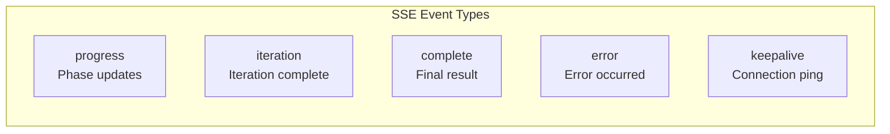
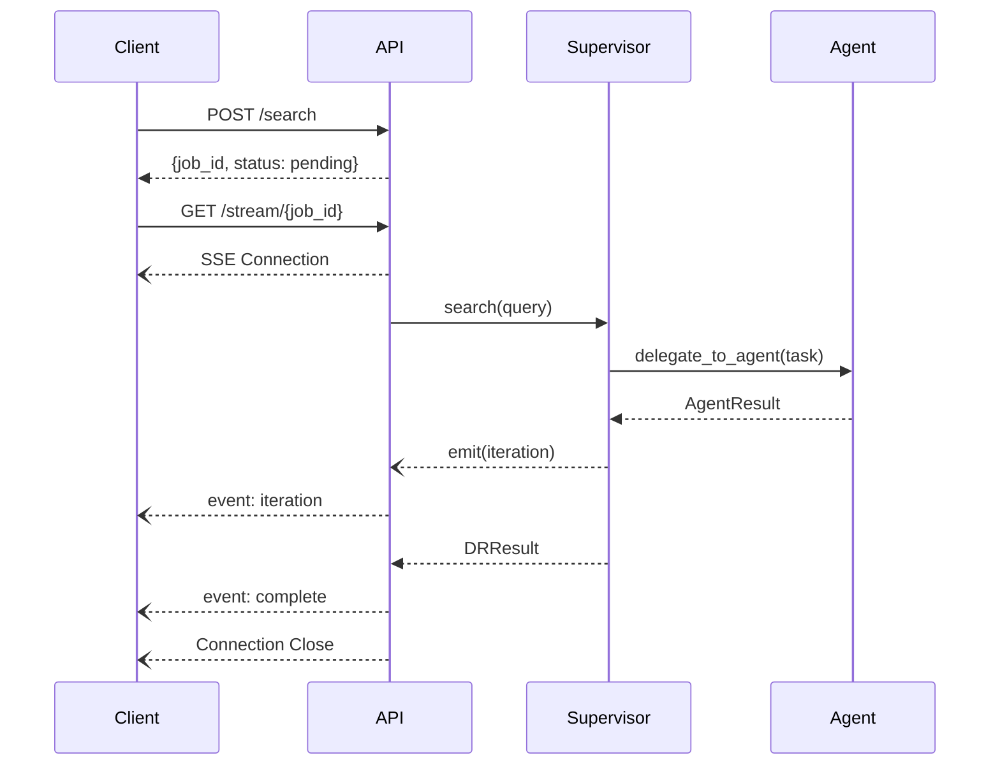
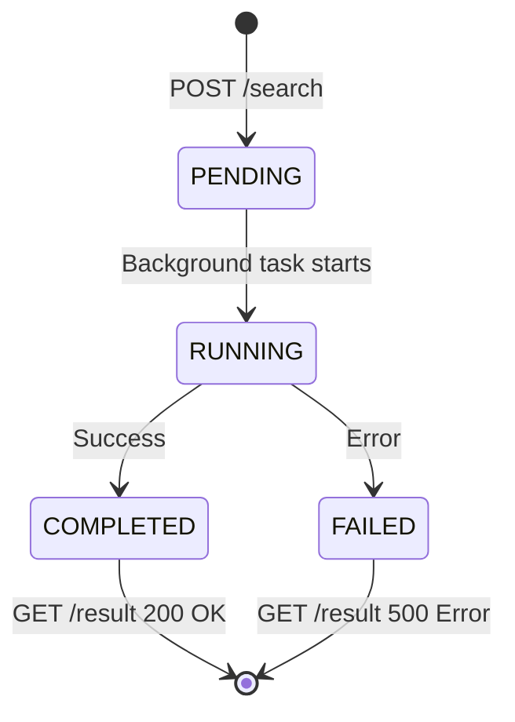

# API Reference

Complete reference for the DeepSearch REST API.

## Endpoints

| Method | Endpoint | Description |
|--------|----------|-------------|
| `POST` | `/api/v1/search` | Start async search job |
| `POST` | `/api/v1/search/sync` | Synchronous search (blocking) |
| `GET` | `/api/v1/search/{job_id}` | Get job status |
| `GET` | `/api/v1/search/{job_id}/result` | Get completed result |
| `GET` | `/api/v1/search/{job_id}/stream` | SSE stream for progress |
| `GET` | `/api/v1/tools` | List registered agents/tools |
| `GET` | `/api/v1/health` | Health check |
| `GET` | `/` | Root info (name, version, docs_url) |

---

## Search Endpoints

### Start Async Search

`POST /api/v1/search`

Starts a search job and returns immediately with a job ID. Use the stream or polling endpoints to get results.

**Request:**

```json
{
  "query": "What is Kubernetes?",
  "max_iterations": 3,
  "exec_strategy": "iterative"
}
```

| Field | Type | Required | Description |
|-------|------|----------|-------------|
| `query` | string | Yes | The search query |
| `max_iterations` | int | No | Max search iterations (default: 3) |
| `exec_strategy` | string | No | `iterative` or `parallel` (default: `iterative`) |

**Response:** `200 OK`

```json
{
  "job_id": "abc123-456-def",
  "status": "pending",
  "created_at": "2025-01-22T10:30:00Z"
}
```

### Synchronous Search

`POST /api/v1/search/sync`

Executes search and blocks until complete. Use for simple integrations that don't need streaming.

**Request:** Same as async search.

**Response:** `200 OK` - Full `SearchResultResponse` (see below).

### Get Job Status

`GET /api/v1/search/{job_id}`

**Response:** `200 OK`

```json
{
  "job_id": "abc123-456-def",
  "status": "running",
  "progress": "Searching documentation...",
  "current_iteration": 2,
  "created_at": "2025-01-22T10:30:00Z",
  "updated_at": "2025-01-22T10:30:05Z"
}
```

| Status | Description |
|--------|-------------|
| `pending` | Job created, not yet started |
| `running` | Search in progress |
| `completed` | Search finished successfully |
| `failed` | Search failed with error |

### Get Job Result

`GET /api/v1/search/{job_id}/result`

Returns the full result once the job is complete.

**Response:** `200 OK`

```json
{
  "job_id": "abc123-456-def",
  "status": "completed",
  "query": "What is Kubernetes?",
  "final_report": "## Kubernetes Overview\n\nKubernetes is...",
  "concise_answer": "Kubernetes is an open-source container orchestration platform...",
  "confidence_score": 0.85,
  "total_iterations": 2,
  "processing_time_ms": 4500,
  "sources": [
    {
      "id": "doc-123",
      "title": "Kubernetes Documentation",
      "url": "https://kubernetes.io/docs/",
      "score": 0.92
    }
  ],
  "iterations": [
    {
      "iteration_number": 1,
      "tools_called": ["elasticsearch_confluence"],
      "decision": "CONTINUE"
    },
    {
      "iteration_number": 2,
      "tools_called": ["websearch"],
      "decision": "COMPLETE"
    }
  ],
  "created_at": "2025-01-22T10:30:00Z",
  "completed_at": "2025-01-22T10:30:05Z"
}
```

**Error:** `425 Too Early` if job not yet completed.

---

## SSE Streaming

`GET /api/v1/search/{job_id}/stream`

Returns a Server-Sent Events stream with real-time progress updates.

**Headers:**

```
Content-Type: text/event-stream
Cache-Control: no-cache
Connection: keep-alive
X-Accel-Buffering: no
```

### Event Types



#### progress

Phase updates during search execution.

```
event: progress
data: {"phase": "searching", "message": "Executing search...", "agent": "elasticsearch"}
```

#### iteration

Emitted after each search iteration completes.

```
event: iteration
data: {"iteration_number": 1, "tools_called": ["elasticsearch_confluence"], "decision": "CONTINUE"}
```

#### complete

Final result - triggers stream close.

```
event: complete
data: {"job_id": "...", "final_report": "...", "concise_answer": "...", ...full result}
```

#### error

Error occurred during search.

```
event: error
data: {"error": "LLM connection failed", "detail": "Connection timeout after 30s"}
```

#### keepalive

Empty event sent every 30 seconds to prevent connection timeout.

```
event: keepalive
data: {}
```

### SSE Event Format

```
id: abc123-1
event: progress
data: {"phase": "starting", "message": "Search started"}

id: abc123-2
event: iteration
data: {"iteration_number": 1, "tools_called": ["docs"], "decision": "CONTINUE"}

id: abc123-3
event: complete
data: {...full result JSON...}
```

---

## Other Endpoints

### List Tools

`GET /api/v1/tools`

**Response:** `200 OK`

```json
{
  "tools": [
    {
      "name": "elasticsearch_confluence",
      "description": "Search Confluence documentation",
      "type": "agent"
    },
    {
      "name": "websearch",
      "description": "Search the web using SearXNG",
      "type": "agent"
    }
  ]
}
```

### Health Check

`GET /api/v1/health`

**Response:** `200 OK`

```json
{
  "status": "healthy",
  "agents": ["elasticsearch_confluence", "websearch"],
  "tools": 2,
  "llm_configured": true
}
```

---

## HTTP Status Codes

| Status | Description |
|--------|-------------|
| `200` | Success |
| `404` | Job or stream not found |
| `425` | Too Early - job not yet completed |
| `500` | Server error (LLM failure, search error) |
| `503` | Service unavailable (supervisor not configured) |

---

## Request Flow



---

## Job State Machine



---

## Examples

### cURL: Async Search with Streaming

```bash
# Start search
JOB_ID=$(curl -s -X POST http://localhost:8000/api/v1/search \
  -H "Content-Type: application/json" \
  -d '{"query": "How do I configure logging?"}' | jq -r '.job_id')

# Stream events
curl -N http://localhost:8000/api/v1/search/$JOB_ID/stream
```

### cURL: Sync Search

```bash
curl -X POST http://localhost:8000/api/v1/search/sync \
  -H "Content-Type: application/json" \
  -d '{"query": "What are the safety requirements?"}'
```

### Python: Async Search with SSE

```python
import httpx
import json

async def search_with_streaming(query: str):
    async with httpx.AsyncClient() as client:
        # Start job
        response = await client.post(
            "http://localhost:8000/api/v1/search",
            json={"query": query}
        )
        job_id = response.json()["job_id"]

        # Stream events
        async with client.stream(
            "GET",
            f"http://localhost:8000/api/v1/search/{job_id}/stream"
        ) as stream:
            async for line in stream.aiter_lines():
                if line.startswith("data: "):
                    event = json.loads(line[6:])
                    print(event)
```

### JavaScript: EventSource

```javascript
const response = await fetch('/api/v1/search', {
  method: 'POST',
  headers: { 'Content-Type': 'application/json' },
  body: JSON.stringify({ query: 'What is Kubernetes?' })
});
const { job_id } = await response.json();

const eventSource = new EventSource(`/api/v1/search/${job_id}/stream`);

eventSource.addEventListener('progress', (e) => {
  console.log('Progress:', JSON.parse(e.data));
});

eventSource.addEventListener('complete', (e) => {
  console.log('Result:', JSON.parse(e.data));
  eventSource.close();
});

eventSource.addEventListener('error', (e) => {
  console.error('Error:', JSON.parse(e.data));
  eventSource.close();
});
```
