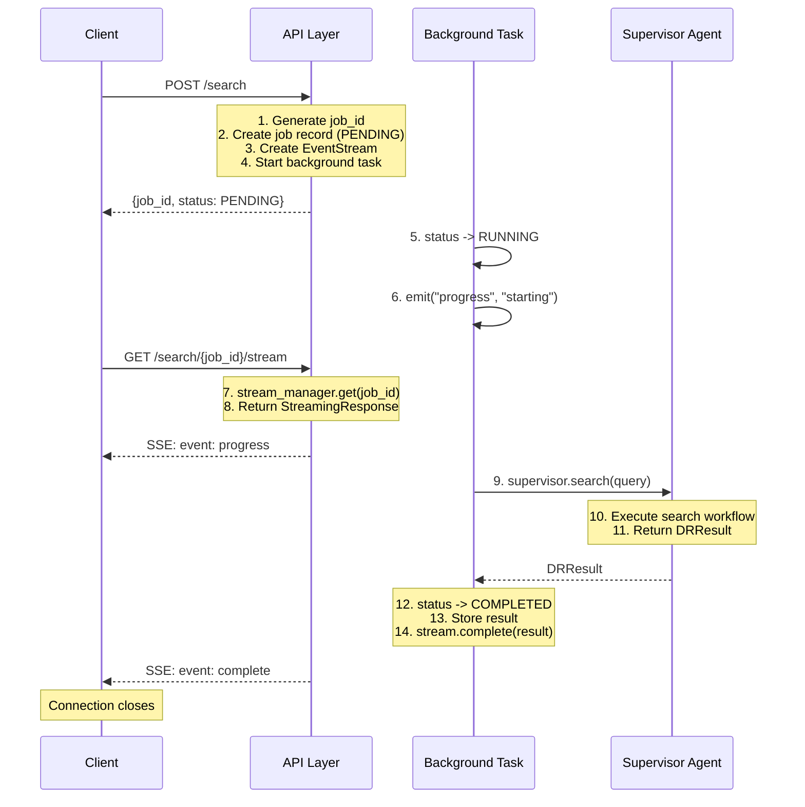
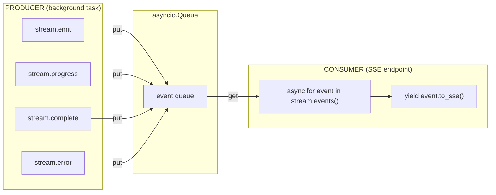
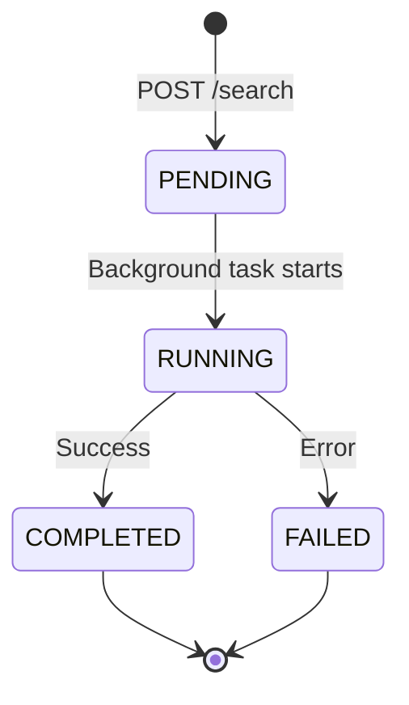

# SSE Streaming Documentation

This document provides a detailed walkthrough of how Server-Sent Events (SSE) streaming works in the DeepSearch service.

---

## Table of Contents

1. [Stream Creation](#stream-creation)
2. [Stream Access](#stream-access)
3. [Stream Blocking](#stream-blocking)
4. [Request Lifecycle](#request-lifecycle)
5. [Queue Mechanism](#queue-mechanism)
6. [SSE Event Format](#sse-event-format)
7. [Implementation Notes](#implementation-notes)

---

## Stream Creation

The stream is created in `routes.py` when a search job starts:

```python
# In start_search endpoint
stream = stream_manager.create(job_id)
```

The `stream_manager` is a **global singleton** defined in `streaming.py`:

```python
stream_manager = StreamManager()
```

---

## Stream Access

There are **two accessors**:

| Accessor | Location | Purpose |
|----------|----------|---------|
| `stream_manager.get(job_id)` | `routes.py` | SSE endpoint retrieves stream to send events to client |
| Direct reference | `routes.py` | Background task receives stream as parameter |

---

## Stream Blocking

The stream can be blocked in several ways:

### Consumer blocking (waiting for events)

```python
# streaming.py - blocks up to 30 seconds waiting for events
event = await asyncio.wait_for(self._queue.get(), timeout=30)
```

If no events arrive within 30 seconds, a **keepalive** is sent to prevent connection timeout.

### Producer blocking (queue full)

The `asyncio.Queue()` is unbounded by default, so the producer (`emit()`) won't block. However, if you created a bounded queue, it would block when full.

### Client disconnect

If the client disconnects mid-stream, the `StreamingResponse` generator stops yielding, but the background task continues running and emitting events (they just go nowhere).

---

## Request Lifecycle



### Step-by-Step Breakdown

| Step | Component | File | What Happens |
|------|-----------|------|--------------|
| 1 | `start_search` | `routes.py` | Generate UUID for job |
| 2 | `start_search` | `routes.py` | Create job record with PENDING status |
| 3 | `stream_manager.create` | `streaming.py` | Create `EventStream` with `asyncio.Queue` |
| 4 | `background_tasks.add_task` | `routes.py` | Schedule `_execute_search` as background task |
| 5 | `_execute_search` | `routes.py` | Update status to RUNNING |
| 6 | `stream.progress` | `routes.py` | Emit first progress event |
| 7 | `stream_search` | `routes.py` | Retrieve stream by job_id |
| 8 | `StreamingResponse` | `routes.py` | Start SSE response with proper headers |
| 9 | `supervisor.search` | `routes.py` | Call supervisor agent |
| 10-11 | `SupervisorAgent` | `agent.py` | Execute search workflow |
| 12 | `_execute_search` | `routes.py` | Update status to COMPLETED |
| 13 | `_execute_search` | `routes.py` | Store result in `_jobs` dict |
| 14 | `stream.complete` | `routes.py` | Emit final "complete" event |

---

## Queue Mechanism

The core of streaming is the `asyncio.Queue` in `streaming.py`:



### Producer Methods

- `stream.emit()` - Generic event emission
- `stream.progress()` - Progress update events
- `stream.complete()` - Final result event
- `stream.error()` - Error event

### Consumer Methods

- `async for event in stream.events()` - Async iteration over queue
- `yield event.to_sse()` - Format and yield SSE response

---

## SSE Event Format

Events are formatted by `to_sse()` in `streaming.py`:

```
id: abc123-1
event: progress
data: {"phase": "starting", "message": "search started"}

id: abc123-2
event: complete
data: {"job_id": "abc123", "answer": "...", "sources": [...]}
```

### Event Types

| Event | Description | Payload |
|-------|-------------|---------|
| `progress` | Phase updates | `{"phase": "searching", "message": "..."}` |
| `iteration` | Iteration complete | `{"iteration_number": 1, "tools_called": [...]}` |
| `complete` | Final result | Full SearchResultResponse JSON |
| `error` | Error occurred | `{"error": "...", "detail": "..."}` |
| `keepalive` | Connection ping | `{}` (empty, sent every 30s) |

---

## Implementation Notes

### No Streaming from Supervisor

The `SupervisorAgent` doesn't emit progress events during its iterations. It runs to completion and returns a `DRResult`. Only the API layer emits "starting" and "complete" events.

### Gap in Iteration Streaming

Currently, intermediate iteration progress (which tool is being called, quality assessments) is NOT streamed to the client. The `EventStream.iteration()` method exists but isn't called from the supervisor.

### Memory Leak Potential

Completed streams stay in `StreamManager._streams` until `cleanup_completed()` is called. There's no automatic cleanup visible in the routes.

---

## Job State Machine



---

## Related Documentation

- [API Reference](API_REFERENCE.md) - Endpoint documentation
- [Architecture](../ARCHITECTURE.md) - System design overview
