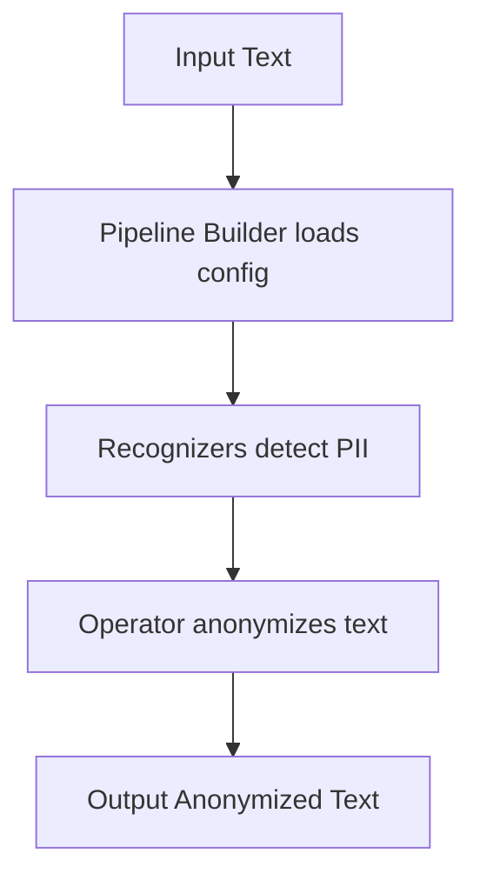

# 🛠️ How to Use the Anonymization System

## 1. **Project Structure Overview**

- **Configs**: Define which recognizers and operators to use (pipelines).
- **Recognizers**: Detect PII (e.g., names, phone numbers).
- **Operators**: Anonymize detected PII.
- **Pipeline Builder**: Assembles everything based on config.
- **User Interface / API**: Where you provide your text.

---

## 2. **General Usage Flow**

### **Step 1: Prepare Your Pipeline Configuration**

- Choose or create a pipeline config (JSON) in `user_configs/pipelines/`.
    - Example: `flair_with_presidio_phone_pipeline.json`
    - This config specifies which recognizers and operators to use.

### **Step 2: Load the Pipeline**

- Use the `PluginBasedPipelineBuilder` to load and build the pipeline from your config.

### **Step 3: Process Your Text**

- Pass your text to the recognizers via the pipeline.
- Collect detected entities.
- Pass entities and text to the operator for anonymization.

---

## 3. **Minimal Example Template**

Here's a **template** you can use as a script or in a function, with placeholders for your text:

```python
import json
from pii_deid_service.pipeline.builder import PluginBasedPipelineBuilder
from pii_deid_service.config_management.plugin_schemas import PluginPipelineConfig
from pii_deid_service.pipeline import run_pipeline

# 1. Load pipeline configuration
config_path = "user_configs/pipelines/flair_with_presidio_phone_pipeline.json"  # or any other pipeline
with open(config_path, "r", encoding="utf-8") as f:
    config_data = json.load(f)
config = PluginPipelineConfig(**config_data)

# 2. Build the pipeline
builder = PluginBasedPipelineBuilder()
builder.initialize()
pipeline = builder.build_pipeline(config)

# 3. Your input text (replace this with your actual text)
text = "John Doe's phone number is +49-30-123-4567 and he lives in Berlin."

# 4. Anonymize the text using the pipeline
anonymized_text = run_pipeline(pipeline, text)

print("Original:", text)
print("Anonymized:", anonymized_text)
```

---

## 4. **As a Library: How Others Can Use It**

- **Import the pipeline builder and config classes** as above.
- **Provide their own pipeline config** (or use your templates).
- **Call the recognizer and operator methods** as shown.
- **Wrap the above in a function or class** for repeated use or API integration.

---

## 5. **Step-by-Step Guidance**

### **A. As a Script**
1. Place your text in the `text` variable.
2. Choose the pipeline config that fits your needs.
3. Run the script.

### **B. As a Library**
1. Install the package (if published).
2. Import the builder and config classes.
3. Load or create a pipeline config.
4. Build the pipeline.
5. Call recognizer(s) and operator(s) as needed.

---

## 6. **General Template (Function Form)**

```python
def anonymize_text(text, config_path):
    import json
    from pii_deid_service.pipeline.builder import PluginBasedPipelineBuilder
    from pii_deid_service.config_management.plugin_schemas import PluginPipelineConfig
    from pii_deid_service.pipeline import run_pipeline

    with open(config_path, "r", encoding="utf-8") as f:
        config_data = json.load(f)
    config = PluginPipelineConfig(**config_data)

    builder = PluginBasedPipelineBuilder()
    builder.initialize()
    pipeline = builder.build_pipeline(config)

    return run_pipeline(pipeline, text)
```

**Usage:**
```python
anonymized = anonymize_text("My phone is +49-30-123-4567", "user_configs/pipelines/flair_with_presidio_phone_pipeline.json")
print(anonymized)
```

---

## 7. **Available Pipeline Configurations**

### **Pipeline Options:**

| Pipeline File | Description | Best For |
|---------------|-------------|----------|
| `flair_only_pipeline.json` | Flair model only (no phone detection) | Basic NER tasks |
| `flair_with_custom_phone_pipeline.json` | Flair + Custom German phone recognizer | German text with phone numbers |
| `flair_with_presidio_phone_pipeline.json` | Flair + Presidio's built-in phone recognizer | International phone number support |

### **Language Support:**
- **German**: Use `language="de"` in recognizer calls
- **English**: Use `language="en"` in recognizer calls
- **Other languages**: Check recognizer documentation

---

## 8. **How to Extend or Integrate**

### **Add New Recognizers:**
1. Implement your recognizer class
2. Create a plugin wrapper
3. Register it in `pii_deid_service/plugins/builtin/recognizer_plugins.py`
4. Update your pipeline config

### **Add New Operators:**
1. Implement your operator class
2. Create a plugin wrapper
3. Register it in the operator plugins
4. Update your pipeline config

### **Change Pipeline:**
Just point to a different config file in your code.

### **Integrate with Web/API:**
Wrap the logic in a Flask/FastAPI/Django endpoint.

---

## 9. **Diagram: High-Level Flow**



---

## 10. **Summary Table**

| Step | What to Do | Example Class/Function |
|------|------------|-----------------------|
| 1    | Load config | `PluginPipelineConfig` |
| 2    | Build pipeline | `PluginBasedPipelineBuilder` |
| 3    | Recognize entities | `recognizer.recognize()` |
| 4    | Anonymize | `operator.apply()` |
| 5    | Output | Print or return result |

---

## 11. **Best Practices**

- **Always validate your pipeline config** before running
- **Use the modularity**: swap recognizers/operators as needed
- **For production**: wrap the logic in a function or API endpoint
- **Error handling**: Add try-catch blocks around pipeline operations
- **Performance**: Reuse pipeline instances for multiple texts

---

## 12. **Example Use Cases**

### **Case 1: German Text with Phone Numbers**
```python
config_path = "user_configs/pipelines/flair_with_presidio_phone_pipeline.json"
text = "Hallo, mein Name ist Hans Müller. Meine Telefonnummer ist +49-30-123-4567."
# Use language="de"
```

### **Case 2: English Text with Basic NER**
```python
config_path = "user_configs/pipelines/flair_only_pipeline.json"
text = "John Doe works at Microsoft in Seattle."
# Use language="en"
```

### **Case 3: Custom Phone Detection**
```python
config_path = "user_configs/pipelines/flair_with_custom_phone_pipeline.json"
text = "Contact me at 030-987-6543 or (030) 123-7890"
# Use language="de"
```

---

## 13. **Troubleshooting**

### **Common Issues:**

1. **Pipeline not building**: Check config file path and JSON syntax
2. **No entities detected**: Verify language parameter matches your text
3. **Import errors**: Ensure all dependencies are installed
4. **Model loading issues**: Check model file paths in configs

### **Debug Steps:**
1. Test with simple text first
2. Check pipeline builder logs
3. Verify recognizer initialization
4. Test individual components separately

---

## 14. **API Integration Example**

```python
from flask import Flask, request, jsonify

app = Flask(__name__)

@app.route('/anonymize', methods=['POST'])
def anonymize_api():
    data = request.get_json()
    text = data.get('text', '')
    config_path = data.get('config_path', 'user_configs/pipelines/flair_with_presidio_phone_pipeline.json')
    
    try:
        anonymized = anonymize_text(text, config_path)
        return jsonify({
            'success': True,
            'original': text,
            'anonymized': anonymized
        })
    except Exception as e:
        return jsonify({
            'success': False,
            'error': str(e)
        }), 500

if __name__ == '__main__':
    app.run(debug=True)
```

---

## 15. **Getting Started Checklist**

- [ ] Choose appropriate pipeline configuration
- [ ] Set up your development environment
- [ ] Test with sample text
- [ ] Integrate into your application
- [ ] Add error handling
- [ ] Test with real data
- [ ] Deploy and monitor

---

**Ready to anonymize your text!** 🚀

For more examples and advanced usage, check the test files in the project root. 